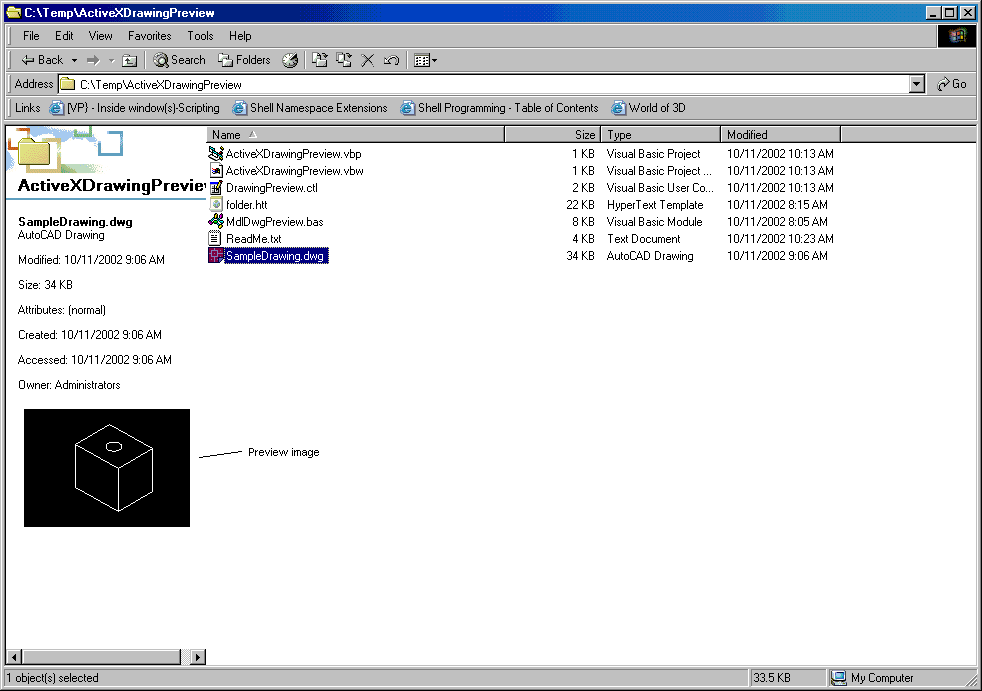



## ActiveXDrawingPreview

### Description

The first of its kind on psc. Explorer Add-on. ActiveX thumbnail viewer. add thumbnail veiws to explorer of your file types, just like the bitmaps images on the left side of explorer.

View AutoCAD drawings thru Explorer.

It doen't have to be just AutoCad files, it can be anything you want.

Also, ActiveX Desktop. Please vote. see preview.
 
### More Info
 
The first on its kind psc. Explorer Add-on. ActiveX thumbnail viewer. Just Like viewing bitmaps in the left side.

View AutoCAD drawings thru Explorer.

It doen't have to be just AutoCad files, it can be anything you want.

Also, ActiveX Desktop. Please vote. see preview.

             |
---                |---
**Submitted On**   |2002-10-11 10:29:42
**By**             |[Michael VanHoose](https://github.com/Planet-Source-Code/PSCIndex/blob/master/ByAuthor/michael-vanhoose.md)
**Level**          |Advanced
**User Rating**    |4.7 (42 globes from 9 users)
**Compatibility**  |VB 6\.0
**Category**       |[OLE/ COM/ DCOM/ Active\-X](https://github.com/Planet-Source-Code/PSCIndex/blob/master/ByCategory/ole-com-dcom-active-x__1-29.md)
**World**          |[Visual Basic](https://github.com/Planet-Source-Code/PSCIndex/blob/master/ByWorld/visual-basic.md)
**Archive File**   |[ActiveXDra14445910112002\.zip](https://github.com/Planet-Source-Code/michael-vanhoose-activexdrawingpreview__1-39727/archive/master.zip)

